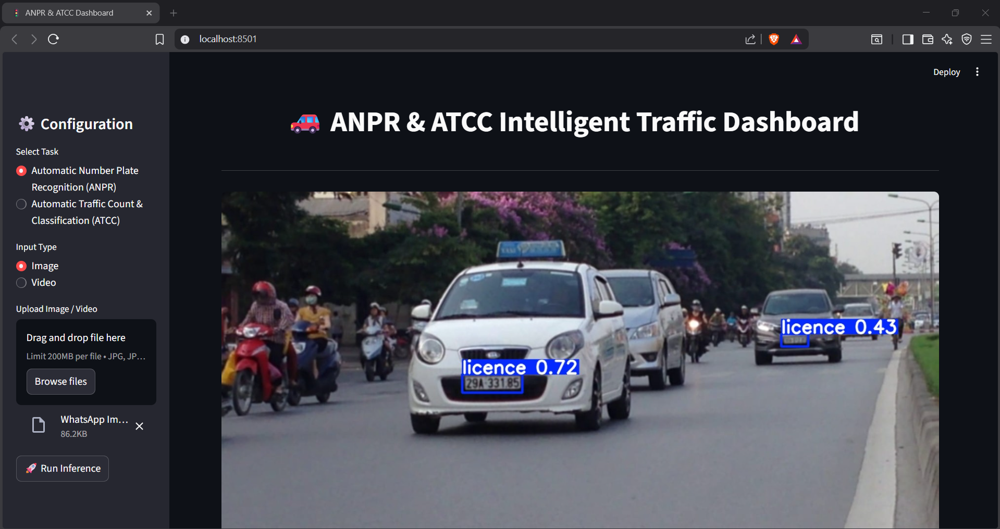
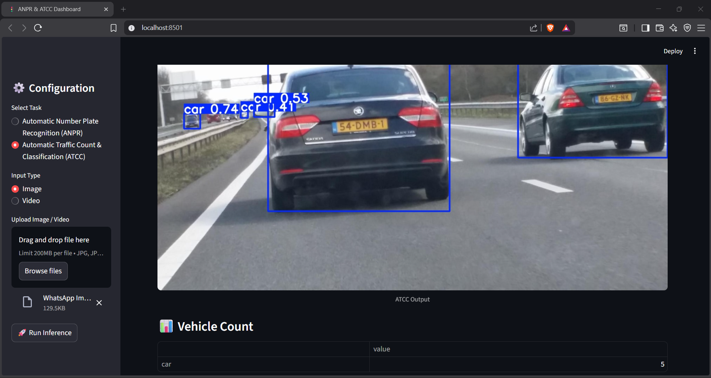

🚦 ANPR & ATCC Intelligent Traffic Analysis System

A Streamlit-based deep learning dashboard for Automatic Number Plate Recognition (ANPR) and Automatic Traffic Count & Classification (ATCC) using YOLOv8.

This project allows users to upload traffic images and perform real-time object detection to:

Detect vehicle number plates (ANPR)

Detect, classify, and count vehicles (ATCC)

📌 Features
🔹 Automatic Number Plate Recognition (ANPR)

Detects vehicle number plates from images

Draws bounding boxes around detected plates

Powered by a custom-trained YOLOv8 model

🔹 Automatic Traffic Count & Classification (ATCC)

Detects vehicles such as:

Car

Bus

Truck

Motorbike

Displays:

Bounding boxes with confidence scores

Vehicle-wise count in tabular format

🔹 Interactive Dashboard

Built using Streamlit

Simple UI with task selection

Fast and lightweight inference

🧠 Technology Stack
Component	Technology
Programming Language	Python
Deep Learning Framework	PyTorch
Object Detection Model	YOLOv8 (Ultralytics)
Frontend	Streamlit
Image Processing	OpenCV
Deployment	Local / GitHub
📁 Project Structure
ANPR-ATCC/
│
├── app.py                     # Streamlit application
│
├── models/
│   ├── best_anpr.pt            # Trained ANPR model
│   └── best_atcc.pt            # Trained ATCC model
│
├── modules/
│   ├── anpr.py                 # ANPR inference logic
│   └── atcc.py                 # ATCC inference & counting logic
│
├── test_images/                # Sample images for testing
│   ├── img1.jpg
│   ├── img2.jpg
│
├── requirements.txt            # Project dependencies
└── README.md                   # Project documentation

⚙️ Installation & Setup
1️⃣ Clone the Repository
git clone https://github.com/<your-username>/ANPR-ATCC.git
cd ANPR-ATCC

2️⃣ Create Virtual Environment (Optional but Recommended)
python -m venv venv
venv\Scripts\activate      # Windows
source venv/bin/activate   # Linux / Mac

3️⃣ Install Dependencies
pip install -r requirements.txt

🚀 Running the Application

Start the Streamlit dashboard using:

streamlit run app.py

The app will open in your browser at:

http://localhost:8501

🧪 How to Use

Select ANPR or ATCC from the sidebar

Upload a traffic image (jpg / png)

Click Run Inference

View:

Bounding boxes on detected objects

Vehicle counts (for ATCC)

📊 Output Examples
ANPR Output

Number plate detected with bounding box

ATCC Output

Vehicles detected with class labels

Confidence scores displayed

Vehicle count table generated

📝 Notes

This project currently supports image-based inference only

Video inference was intentionally excluded to ensure:

Stability

Faster execution

Easier evaluation and demonstration

📦 Requirements

Main libraries used:

streamlit

ultralytics

opencv-python

numpy

torch

(Complete list available in requirements.txt)